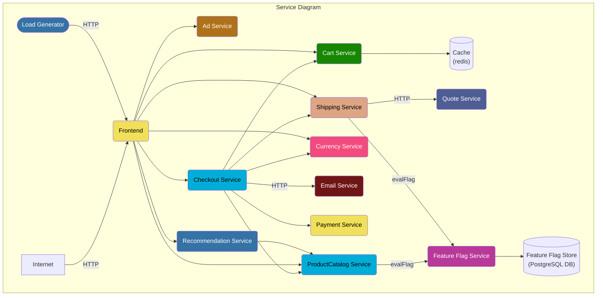
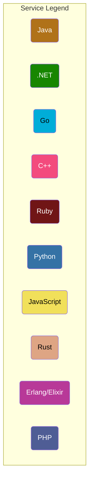

# Kubernestes Observability Demo

This repository will explain how to deploy the various CNCF project to observe properly your Kubernetes cluster .
This repository is based on the popular Demo platform provided by Google : The Online Boutique
<p align="center">

</p>

**Online Boutique** is a cloud-native microservices demo application.
Online Boutique consists of a 10-tier microservices application. The application is a
web-based e-commerce app where users can browse items,
add them to the cart, and purchase them.
The Google HipsterShop is a microservice architecture using several langages :
* Go 
* Python
* Nodejs
* C#
* Java

# Documentation

- [Demo Screenshots](./docs/demo_screenshots.md)
- [Feature Flags](./docs/feature_flags.md)
- [Manual Span Attributes](./docs/manual_span_attributes.md)
- [Metric Feature Coverage by Service](./docs/metric_service_features.md)
- [Requirements](./docs/requirements/README.md)
- [Service Roles](./docs/service_table.md)
- [Trace Feature Coverage by Service](./docs/trace_service_features.md)

## Architecture

**Online Boutique** is composed of microservices written in different programming
languages that talk to each other over gRPC and HTTP; and a load generator which
uses [Locust](https://locust.io/) to fake user traffic.






## Prerequisite
The following tools need to be install on your machine :

- jq
- kubectl
- git
- helm

## Getting started locally

### Quick Start with k3d

First of all, build the demo image:

```bash
make build
```

Then, run the demo:

```bash
make run
```
## Getting started in the cloud

* [Deployment Steps in GCP](https://github.com/observe-k8s/Observe-k8s-demo/tree/gke)
* [Deployment Steps in EKS](https://github.com/observe-k8s/Observe-k8s-demo/tree/eks)


